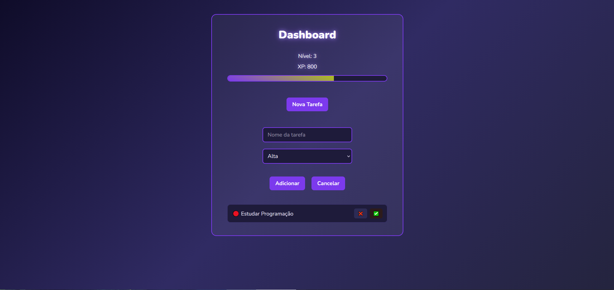

# 🕹️ Dashboard de Tarefas Gamificado

Aplicação web de gerenciamento de tarefas com sistema de gamificação.  
O usuário pode criar tarefas, definir prioridades e ganhar XP ao concluí-las, evoluindo de nível conforme progride.

## 🚀 Funcionalidades

- Criar tarefas
- Definir prioridade (Alta, Média, Baixa)
- Excluir tarefas
- Marcar tarefas como concluídas
- Sistema de XP baseado na dificuldade da tarefa
- Sistema de níveis
- Barra de progresso de XP
- Ordenação automática por prioridade
- Persistência de dados usando **LocalStorage**

## 🎮 Sistema de Gamificação

Cada tarefa concede XP de acordo com sua prioridade:

| Prioridade | XP |
|------------|----|
| 🔴 Alta | 100 XP |
| 🟠 Média | 50 XP |
| 🟡 Baixa | 25 XP |

O nível do usuário aumenta conforme o XP acumulado.

## 🛠️ Tecnologias Utilizadas

- React
- CSS3
- LocalStorage

## 📸 Demonstração

## 🔗 Demo

https://e-danillon.github.io/dashboard-de-tarefas-gamificado-react/

## 📌 Objetivo do Projeto

Este projeto foi desenvolvido com o objetivo de praticar:

- Componentização com React
- Gerenciamento de estado com useState e useEffect
- Persistência de dados no navegador
- Organização de lógica em aplicações front-end

## 👨‍💻 Autor

**Emerson Danillo**  
Estudante de Ciência da Computação  
GitHub: https://github.com/E-Danillon